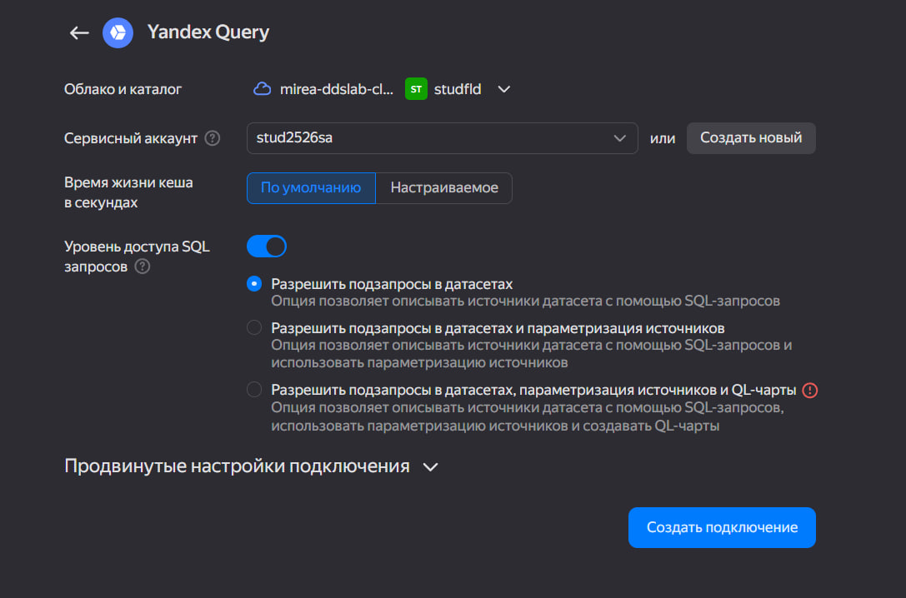
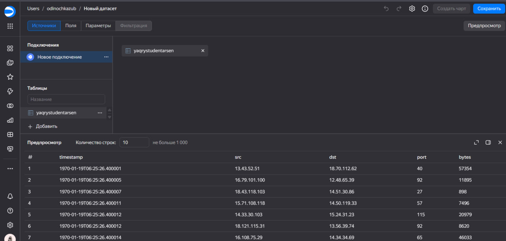
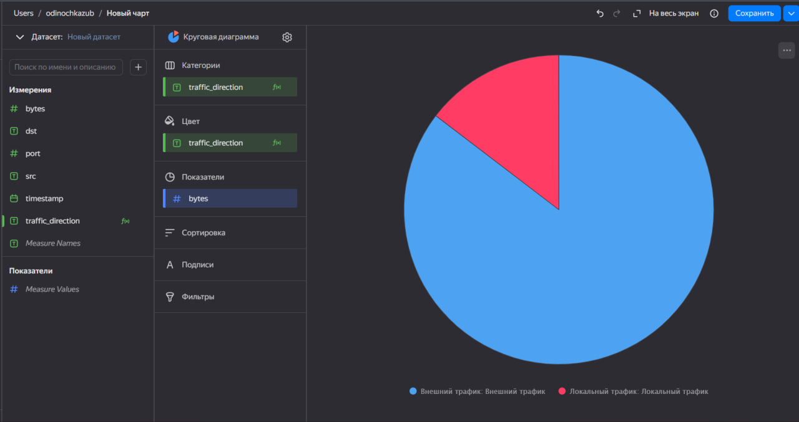
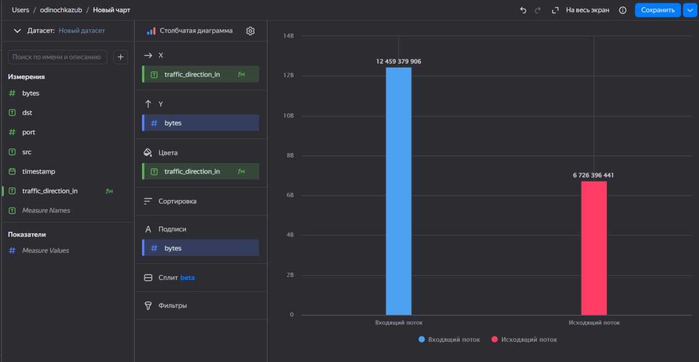
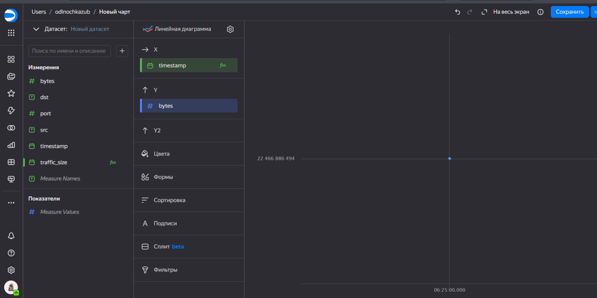
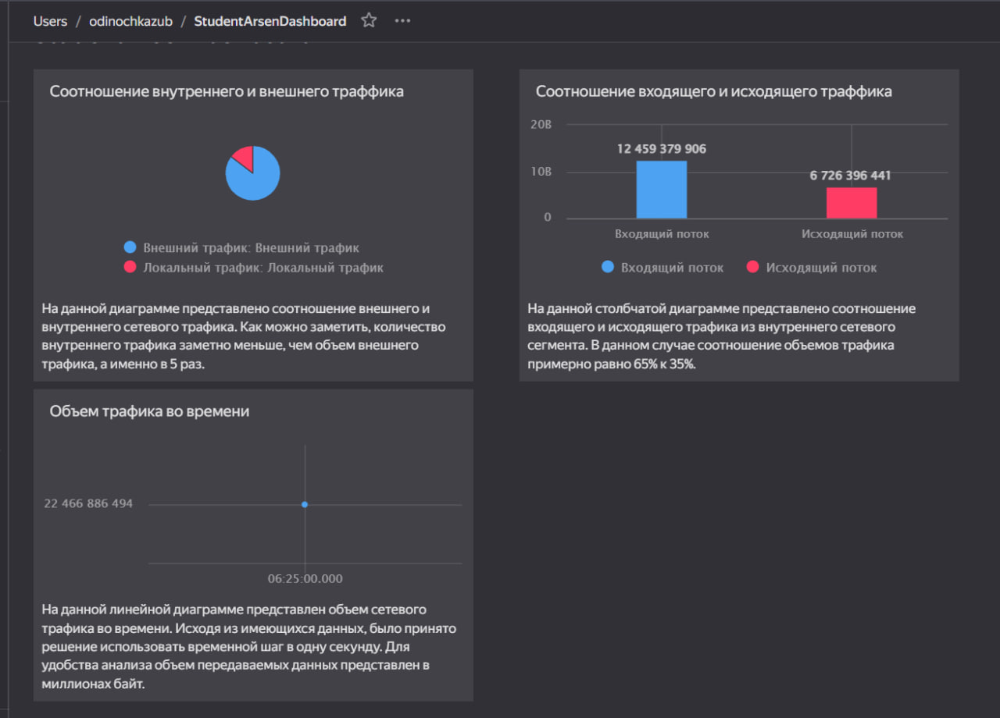

# Практическая работа №8


## Цель работы

1.  Изучить возможности технологии Yandex DataLens для визуального
    анализа структурированных наборов данных
2.  Получить навыки визуализации данных для последующего анализа с
    помощью сервисов Yandex Cloud
3.  Получить навыки создания решений мониторинга/SIEM на базе облачных
    продуктов и открытых программных решений
4.  Закрепить практические навыки использования SQL для анализа данных
    сетевой активности в сегментированной корпоративной сети

## Исходные данные

1.  Программное обеспечение ОС Windows 11 Pro
2.  RStudio
3.  Интерпретатор языка R

## Задание

Используя сервис Yandex DataLens настроить доступ к Yandex Query,
который Вы использовали в ходе ранее выполненных практических работ, и
визуально представить результаты анализа данных.

## План

1.  Настроить интеграцию Yandex Query с DataLens. 1.1. Перейти в нужный
    сервис. 1.2. В разделе “Подключения” выбрать “Создать подключение”.
    1.3. В категории “Файлы и сервисы” указать Yandex Query.
2.  На основе Yandex Query запроса сформировать DataLens датасет.
3.  Создать три визуализации. 3.1. Круговая диаграмма, отображающая
    распределение внешнего и внутреннего сетевого трафика. 3.2.
    Столбчатая диаграмма, показывающая соотношение входящего и
    исходящего трафика внутреннего сегмента сети. 3.3. Линейный график
    динамики объема трафика по временной шкале.
4.  Составить единый дашборд со всеми дграфиками.

## Шаги:

#### Шаг 1. Настроить подключение к Yandex Query из DataLens

Создание нового подключения:



### Шаг 2. Создать из запроса YandexQuery датасет DataLens

Добавление датасета:



``` r
5 + 7
```

    [1] 12

### Шаг 3. Создать три визуализации

#### Шаг 3.1. Круговая диаграмма, отображающая распределение внешнего и внутреннего сетевого трафика

Круговая диаграмма соотношения внешнего и внутреннего сетевого трафика:



#### Шаг 3.2. Столбчатая диаграмма, показывающая соотношение входящего и исходящего трафика внутреннего сегмента сети

Итоговая столбчатая диаграмма соотношения входящего и исходящего трафика
из внутреннего сетвого сегмента:



#### Шаг 3.3. Линейный график динамики объема трафика по временной шкале

Итоговая диаграмма объема трафика во времени:



### Шаг 4. Составить единый дашборд со всеми дграфиками.

Итоговый дашборд:



[Ссылка на
дашборд](https://datalens.ru/vghcoi9ee2w6f-studentarsendashboard)

## Оценка результата

В рамках данной практической работы было исследовано использование
технологии Yandex Datalens для анализа данных сетевой активности.

## Вывод

В ходе практической работы мы познакомились с сервисами Yandex Datalens,
как ими пользоваться для визуализации данных, попрактиковались в
составлении различных диаграмм и создания собственного дашборда.
